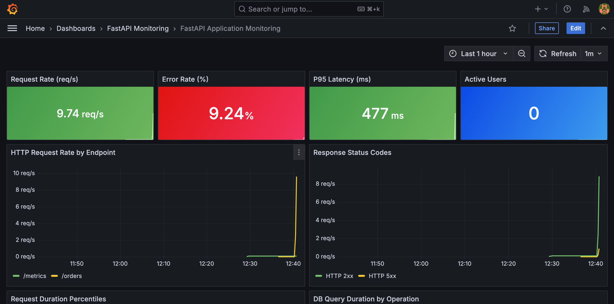
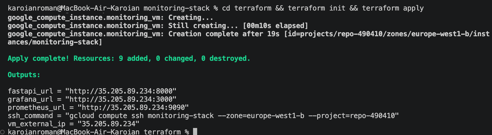
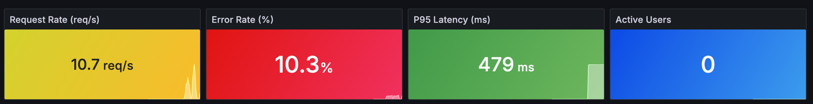
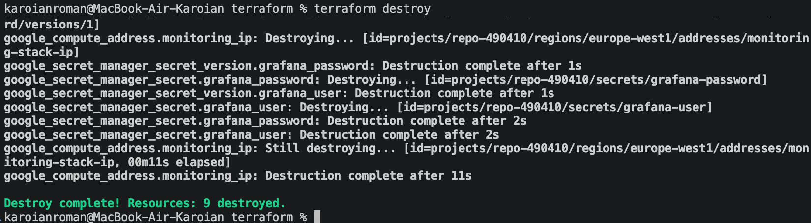

# 📊 Monitoring Stack — Terraform + Prometheus + Grafana + FastAPI

Production-ready observability stack provisioned with Terraform on GCP. Monitors a FastAPI application with real-time metrics, pre-built dashboards, and secrets managed via GCP Secret Manager.

---

## 🖥️ Live Demo



*Real-time metrics: 9.74 req/s, 9.24% error rate, 477ms P95 latency*

---

## 🏗️ Architecture

```
GCP (europe-west1)
└── GCE VM  ← provisioned by Terraform (IaC)
    └── Docker Compose
        ├── fastapi-app   :8000  → /metrics (Prometheus format)
        ├── prometheus    :9090  → scrapes app + node-exporter every 10s
        ├── grafana       :3000  → pre-built dashboards (auto-provisioned)
        └── node-exporter        → host CPU / RAM / disk metrics
```

**Secrets** — Grafana credentials stored in GCP Secret Manager, never in code or `.env` files. VM reads them at startup via metadata API.

---

## 📸 Screenshots

### terraform apply — 9 resources created


### Grafana Dashboard — live metrics under load


### Request Duration Percentiles + DB Query Duration


### terraform destroy — clean teardown


---

## 🚀 Quick Start

### Prerequisites
- Terraform >= 1.9
- GCP project with billing enabled
- `gcloud` CLI authenticated

### 1. Clone and configure

```bash
git clone https://github.com/karoianroman/monitoring-stack.git
cd monitoring-stack/terraform

cp terraform.tfvars.example terraform.tfvars
# Edit terraform.tfvars — set project_id, grafana_user, grafana_password
```

### 2. Deploy

```bash
terraform init
terraform apply
```

Output:
```
Apply complete! Resources: 9 added, 0 changed, 0 destroyed.

fastapi_url    = "http://X.X.X.X:8000"
grafana_url    = "http://X.X.X.X:3000"
prometheus_url = "http://X.X.X.X:9090"
```

### 3. Generate load (demo)

```bash
APP_URL="http://<VM_IP>:8000"

for i in {1..500}; do curl -s "$APP_URL/orders" > /dev/null & done; wait
for i in {1..200}; do curl -s -X POST "$APP_URL/orders" > /dev/null & done; wait
for i in {1..30}; do curl -s "$APP_URL/slow" > /dev/null & done; wait
```

### 4. Teardown

```bash
terraform destroy
```

---

## 📈 Grafana Dashboard Panels

| Panel | Metric | Description |
|-------|--------|-------------|
| Request Rate | `rate(http_requests_total[1m])` | Requests per second |
| Error Rate | `status="5xx"` / total | % of failed requests |
| P95 Latency | `histogram_quantile(0.95, ...)` | 95th percentile response time |
| Active Users | `app_active_users` | Custom gauge metric |
| Request Rate by Endpoint | per `handler` label | `/orders`, `/slow`, `/metrics` |
| Response Status Codes | `2xx` vs `5xx` | HTTP status breakdown |
| Request Duration p50/p95/p99 | histogram percentiles | Latency distribution |
| DB Query Duration | `app_db_query_duration_seconds` | SELECT vs INSERT latency |
| Orders by Status | `app_orders_total` | created / failed / fetched |
| Host CPU | `node_cpu_seconds_total` | VM CPU via node-exporter |

---

## 🗂️ Project Structure

```
monitoring-stack/
├── terraform/
│   ├── main.tf                  # GCE VM, Firewall, Static IP, Secret Manager
│   ├── variables.tf             # Configurable parameters
│   ├── outputs.tf               # URLs after apply
│   ├── startup.sh               # Installs Docker, writes all configs, starts stack
│   └── terraform.tfvars.example # Template for secrets (not committed)
├── monitoring/
│   ├── docker-compose.yml
│   ├── prometheus/
│   │   └── prometheus.yml       # Scrape configs
│   └── grafana/
│       └── provisioning/
│           ├── datasources/     # Prometheus auto-connected
│           └── dashboards/      # Dashboard auto-loaded
└── app/
    ├── main.py                  # FastAPI with custom Prometheus metrics
    ├── requirements.txt
    └── Dockerfile
```

---

## 🔐 Secrets Management

Credentials are **never stored in code or repository**:

```
terraform.tfvars (in .gitignore)
       ↓
Terraform → creates secrets in GCP Secret Manager
       ↓
VM startup.sh → reads secrets via metadata API
       ↓
docker compose → receives credentials as env vars
       ↓
Grafana → authenticated
```

---

## 🔧 Tech Stack

| Tool | Role |
|------|------|
| **Terraform** | Infrastructure as Code — GCE VM, firewall, static IP, Secret Manager |
| **Docker Compose** | Container orchestration on the VM |
| **Prometheus** | Time-series metrics collection |
| **Grafana** | Visualization + auto-provisioned dashboards |
| **Node Exporter** | Host-level metrics (CPU, RAM, disk) |
| **GCP Secret Manager** | Secure credentials storage |
| **FastAPI** | Demo app with `prometheus_fastapi_instrumentator` |